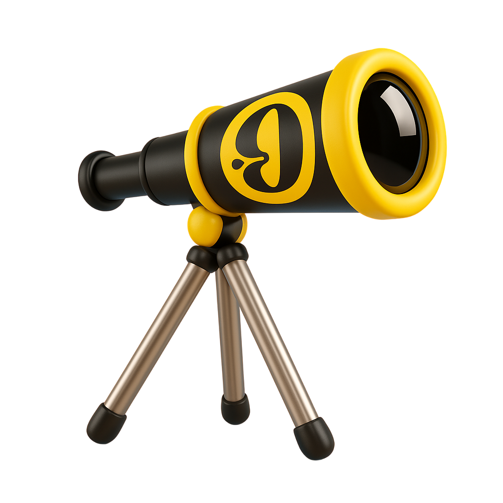

# Horizon Creative – Portfolio Web



## ¿Qué es Horizon Creative?
**Horizon Creative** es una agencia creativa digital especializada en el diseño, desarrollo y promoción de marcas en el entorno online. Nuestro equipo está formado por expertos en diseño web, desarrollo a medida, marketing digital y aplicaciones móviles, ayudando a empresas y emprendedores a destacar en el mundo digital.

La web de Horizon Creative es un portafolio profesional que muestra nuestros servicios, proyectos realizados, equipo y formas de contacto, todo ello con una experiencia visual moderna, animaciones suaves y un diseño responsive.

### Servicios principales:
- Diseño y desarrollo web personalizado
- Estrategias de marketing digital
- Creación de aplicaciones móviles
- Branding y consultoría digital

**Público objetivo:**
- Empresas, startups y profesionales que buscan potenciar su presencia digital y diferenciarse de la competencia.

**Objetivo de la web:**
Presentar la propuesta de valor de Horizon Creative, inspirar confianza y facilitar el contacto para nuevos proyectos.

## Descripción
**Horizon Creative** es una página web de portafolio profesional para agencias creativas, freelancers y estudios de diseño. Permite mostrar proyectos, servicios, equipo y datos de contacto con una experiencia visual moderna y animaciones suaves al hacer scroll.

## Características principales
- **Animaciones de scroll** en todas las secciones (Hero, Servicios, Portfolio, Sobre Nosotros, Footer) usando `framer-motion` y `react-intersection-observer`.
- Diseño responsive y minimalista, compatible con modo claro/oscuro.
- Secciones para presentación, servicios, portafolio de trabajos, equipo y contacto.
- Código modular y fácil de mantener con componentes reutilizables en React/Next.js.

## Tecnologías utilizadas
- **Next.js** (App Router)
- **React**
- **TypeScript**
- **Tailwind CSS**
- **Framer Motion** (animaciones)
- **react-intersection-observer** (detección de scroll)
- **Lucide React** (iconos)

## Estructura del proyecto
```
creative-agency-portfolio/
├── app/
│   ├── components/
│   │   ├── AnimatedSection.tsx
│   │   ├── Header.tsx
│   │   ├── Hero.tsx
│   │   ├── Portfolio.tsx
│   │   ├── Services.tsx
│   │   └── Footer.tsx
│   ├── sobre-nosotros/
│   │   └── page.tsx
│   └── layout.tsx
├── public/
│   └── logotipo.png
├── package.json
└── README.md
```

## Instalación y uso
1. Clona este repositorio:
   ```bash
   git clone https://github.com/420btc/horizoncreative.git
   cd horizoncreative
   ```
2. Instala las dependencias:
   ```bash
   npm install o npm install con legacy peer deeps (buscar comando si hace falta) 
   ```
3. Inicia el servidor de desarrollo:
   ```bash
   npm run dev
   ```
4. Abre [http://localhost:3000](http://localhost:3000) en tu navegador.

## Captura del proyecto


## Autor
**Carlos Freire**  
[GitHub](https://github.com/420btc)

---

> Proyecto desarrollado como portafolio profesional para agencias creativas y freelancers. ¡Personalízalo y hazlo tuyo!
